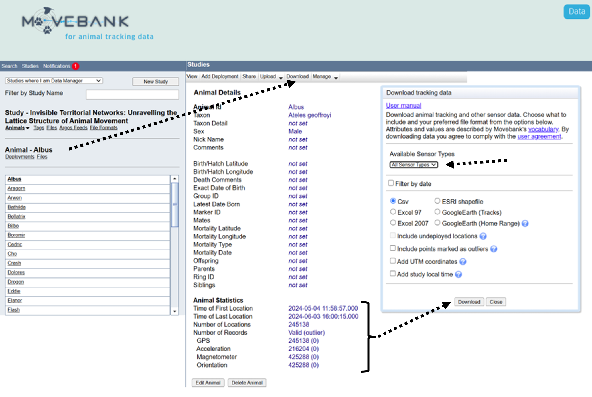
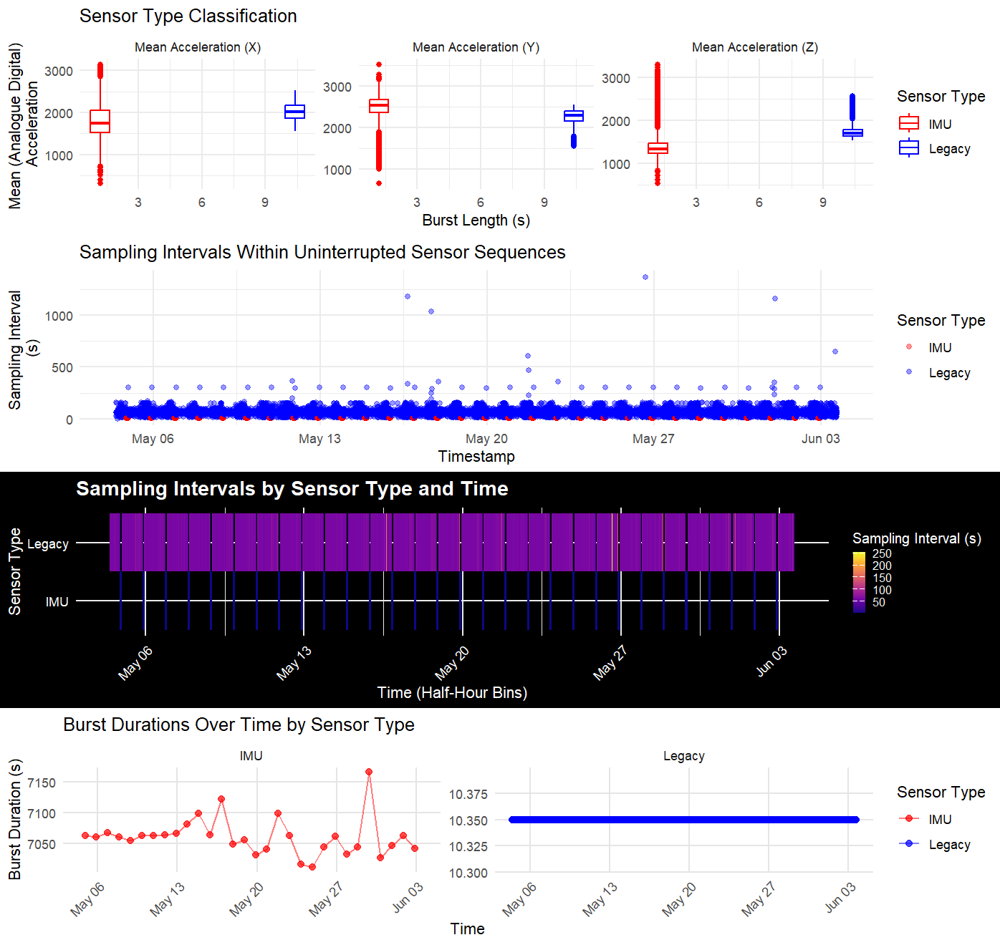

# Eobs_Data_Reader

The `Eobs_Data_Reader` function is an R-based tool designed to automate the pre-processing of **Acceleration**, **Magnetometry**, and **Orientation** data collected from Eobs devices. Leveraging `data.table` coding, this function accelerates the extraction and processing of large datasets, specifically designed to handle individual animal datasets downloaded directly from [Movebank](https://www.movebank.org/).



**[This function is currently in development. Your feedback and testing are highly appreciated! If you encounter any issues or have suggestions for improvement, please feel free to share them.]**

---

## Key Features

### General Functionality

- **Subset Data**: Enables users to subset the dataset to a specified timestamp interval.
- **Data Conversion**: Converts row-wise, space-separated sensor readings (Acceleration, Magnetometry, Quaternions) into long format, where each row represents a single axis/component reading.
- **Dynamic Handling of Sampling Rates**: 
  - Provides an option to standardize acceleration data to a user-specified sampling frequency (Hz), ensuring consistency when multiple sampling rates exist in the dataset.
  - Handles cases where fewer than three acceleration axes are recorded.
- **Burst Duration Standardization**:
  - Option to standardize ACCELERATION burst durations across sensor types (Legacy and IMU ACC sensor) via the new `standardise_burst_duration` parameter.
  - If 'standardise_burst_duration' is set to TRUE, the function Automatically identifies the smallest typical acceleration burst duration representative of recording behavior (excluding anomalies or outliers) by:
    1. Calculating statistics to identify burst duration variability.
    2. Filtering durations using Interquartile Range (IQR) to exclude extreme outliers.
    3. Selecting the smallest typical median burst duration for standardization.
  - Subdivides bursts into uniform durations and adds additional standardized metrics.
- **Timestamp Interpolation**: Automatically interpolates timestamps within data bursts, ensuring uniformly spaced time intervals.

### Sensor-Specific Features

#### Acceleration Data:

- Automatically recognizes the sensor type (Legacy or IMU Accelerometer) and applies the appropriate transformation to convert raw acceleration data into standardized units of **g** (1 g ≈ 9.81 m/s²).
- Provides columns and visualizations for:
  - Acceleration burst durations and intervals over time.
  - Sensor type classification (Legacy vs IMU).
  - Burst IDs for continuous acceleration recordings (but see also 'standardise_burst_duration').

- Computes per-burst acceleration metrics (across burst_ids and standardized_burst_id if 'standardise_burst_duration' is set to TRUE):
  - **Static & Dynamic Acceleration**: Calculated using user-defined rolling averages.
  - **VeDBA**: Computes Vectorial Dynamic Body Acceleration for each burst, accounting for continuous sampling.

#### Orientation Data (Quaternions):

- Converts quaternions (if 20 Hz Orientation data is present) into mathematically meaningful normalised components (W, X, Y, Z) for downstream analysis.

#### Magnetometry Data:

- Processes magnetometry data (if present) into long format.

#### Advanced Error Handling and Progress Indicators
- Validates required columns for each data type, skipping sections with missing data while providing clear console messages.
- Flags potential duplicate timestamps in a dedicated `duplicate_times` column.
- Includes progress bars and detailed console messages to keep users informed about the current processing step.

---

### Flexible Outputs

The output dynamically adjusts based on available data types:

- **Acceleration Data Only**: Returns a data frame named `"Acceleration Data"`.
- **All Data Types Available**:
  - If Magnetometry and Quaternion Data timestamps match, these are combined into a data frame named `"Orientation Data"` and returned alongside `"Acceleration Data"`.
  - If timestamps do not match, a list is returned with relevant names: `"Magnetometry Data"`, `"Quaternion Data"`, and `"Acceleration Data"`.
- **Magnetometry and Quaternion Data Only**:
  - If timestamps match, the datasets are combined into a single data frame named `"Orientation Data"`.
  - If timestamps do not match, a list with `"Magnetometry Data"` and `"Quaternion Data"` is returned.
- **Combination of Acceleration Data with Magnetometry or Quaternion Data**: Returns a list of the available datasets with appropriate names.

---



## Example Workflow

1. **Download Data from Movebank**:
   - Ensure the dataset includes relevant columns for Acceleration, Magnetometry, and/or Orientation data.
   
2. **Load Data in R**:
   - This must be read in using **read.csv()** and **NOT** `fread()`
   ```r
   df <- read.csv("example_movebank_data.csv") 
   ```

3. **Run the Function**:
   ```r
   processed_data <- Eobs_Data_Reader(
     data = df,
     rolling_mean_width = 40, # If 20 Hz frequency, this corresponds to 2 s running mean
     standardised_freq_rate = 20,
     standardised_burst_duration = TRUE,
     start_timestamp = "2024-05-01 00:00:00",
     end_timestamp = "2024-06-01 23:59:59",
     plot = TRUE
   )
   ```

### Required R Packages

The function relies on the following R packages. If any are not installed, the function will automatically install them before proceeding.

- **data.table** 
- **pbapply** 
- **tidyr** 
- **dplyr**
- **ggplot2**
- **cowplot**
- **viridis**
- **knitr**

---

### Output Descriptions

#### **Acceleration Data Output**

**Primary Metadata Columns**:
1. **`burst_id`**: Unique identifier for each burst, based on time and sensor continuity.
2. **`row_id`**: Row index from the original dataset, used to map back to the input data.
3. **`timestamp`**: Original timestamp for each sample, as provided in the raw dataset.
4. **`individual.taxon.canonical.name`**: Scientific name of the tracked species.
5. **`tag.local.identifier`**: Identifier for the tracking tag.
6. **`individual.local.identifier`**: Identifier for the tracked individual.
**Sensor-Specific Metadata**:
7. **`eobs.acceleration.axes`**: Axes recorded for acceleration (e.g., XYZ or subsets like XZ).
8. **`eobs.acceleration.sampling.frequency.per.axis`**: Sampling rate (in Hz) for acceleration data. If standardized_freq_rate is set, this column will reflect that value.
**Processed Acceleration Data**:
10. **`acc_x`, `acc_y`, `acc_z`**: Raw (digital analogue) acceleration values for the respective axes after long-format conversion.
<br> **Timestamps and Durations**:
12. **`interpolated_timestamp`**: Interpolated timestamps within bursts for uniform spacing.
13. **`time_diff`**: Time difference (in seconds) between consecutive samples.
14. **`duplicate_times`**: Boolean flag indicating duplicate extrapolated_timestamp values.
15. **`sensor_sequence`**: Identifier for uninterrupted sequences of the same sensor type.
16. **`sampling_interval`**: Time interval (in seconds) between consecutive samples within uninterrupted sequences.
17. **`burst_duration`**: Total duration of each burst (in seconds).
**Standardized Burst Data** (if `standardise_burst_duration = TRUE`):
18. **`standardized_burst_id`**: Unique identifier for standardized bursts, subdividing original bursts into smaller, uniform durations.
19. **`standardized_burst_duration`**: Duration (in seconds) of each standardized burst, typically equal to the standardized duration unless it's a tail-end segment.
20. **`is_standardized`**: Boolean flag indicating whether the segment matches the standardized duration (TRUE) or is shorter (e.g., tail-end bursts).
**Transformed Acceleration Data**:
21. **`acc_x_g`, `acc_y_g`, `acc_z_g`**: Acceleration values (raw) converted to g units, where 1 g ≈ 9.81 m/s².
**Static and Dynamic Acceleration (per burst_id)**
22.	**`acc_x_static`, `acc_y_static`, `acc_z_static`**: Rolling mean (static component) of acceleration for each axis.
23.	**`acc_x_dynamic`, `acc_y_dynamic`, `acc_z_dynamic`**: Dynamic component of acceleration (raw - static) for each axis.
24.	**`VeDBA`**: Vectorial Dynamic Body Acceleration, computed as the Euclidean norm of dynamic acceleration values (indicative of movement intensity).
**Standardized Metrics (if standardised_burst_duration = TRUE)**
25.	**`standardized_acc_x_static`, `standardized_acc_y_static`, `standardized_acc_z_static`**: Static acceleration components for standardized bursts.
26.	**`standardized_acc_x_dynamic`, `standardized_acc_y_dynamic`, `standardized_acc_z_dynamic`**: Dynamic acceleration components for standardized bursts.
27.	**`standardized_VeDBA`**: VeDBA calculated for each standardized burst.

---

#### **Magnetometer/Quaternion Data Output**
1. **`row_id`**: Row index from the input data.
2. **`timestamp`**: Original timestamps.
3. ** `individual.taxon.canonical.name`**: Taxonomic name of the species associated with the data.
4. ** `tag.local.identifier`**: Identifier for the individual tag used to collect the data, typically unique within a dataset.
5. ** `individual.local.identifier`**: Identifier for the individual animal associated with the tag, used to distinguish between animals in the dataset.
6. ** `eobs.magnetometery.axes`**: Indicates the axes (X, Y, Z) recorded for magnetometry data. Always set to "XYZ" in this dataset.
7. ** `mag.magnetic.field.sampling.frequency.per.axis`**: Sampling frequency (in Hz) of the magnetometry sensor, indicating how frequently data points are recorded per axis.
8. **`mag_x`, `mag_y`, `mag_z`**: Magnetic field data (XYZ axes).
9. ** `burst_length`**: Number of data points within a burst, representing the duration of a continuous recording session.
10. **`interpolated_timestamp`**: Interpolated timestamps within bursts for uniform spacing.
11. **`time_diff`**: Time difference (in seconds) between consecutive samples.
12. **`duplicate_times`**: Boolean flag indicating duplicate extrapolated_timestamp values.
13. **`burst_id`**: Unique identifier for each burst, based on time and sensor continuity.
14. **`quat_w`, `quat_x`, `quat_y`, `quat_z`**: Quaternion data components, normalized.

---

## License

This project is licensed under the MIT License.

## Contact

For questions, bug reports, suggestions, or contributions, please contact:
- Richard Gunner
- Email: rgunner@ab.mpg.de
- GitHub: [Richard6195](https://github.com/Richard6195)


